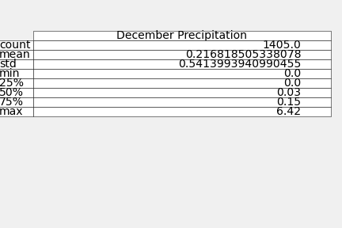

# surfs_up

UTDA Module 9

## Challenge Discussion

The purpose of this challenge was to compare the key statistics for the weather data for June and December in order to convince investors to invest in a Surf and Ice Cream Shop on the Island of Oahu.  The code for this project is in the Challenge section for the "climate_analysis.ipynb" file in this repository.

The table below shows the temperature statistics for June for all weather stations and years.

The table below shows the temperature statistics for December for all weather stations and years.

The mean temperature for June is 75 degrees vs 71 in December. Those temperatures are close enough to assume that the temperature would not have a significant impact on the business

Another factor in the included dataset is the precipitation data, and it is worth including in the analysis

The table below shows the precipitation statistics for June for all weather stations and years.

The table below shows the precipitation statistics for June for all weather stations and years.

The mean precipitation in June is 0.14 inches per day vs. 0.22 inches per day in December.  That is a significant difference, however the 50% quartile is 0.02 inches in June and 0.03 inches in December which indicated a similar number of rainy days in each month, which would indicate that the number of rainy days for each month is similar enough not to affect the business.

There are 2 things not included in the dataset that should be looked at prior to opening the Surf and Ice Cream Shop.  First, the surf reports for the area where the shop is going to open should be reviewed. The temperature and rain will affect the business, but having good surfing conditions consistently will have an impact as well.  The second analysis that should be done is looking at the location of each weather station and ensure that the weather at the business location has similar parameters to the total analysis by only including nearby weather stations.
